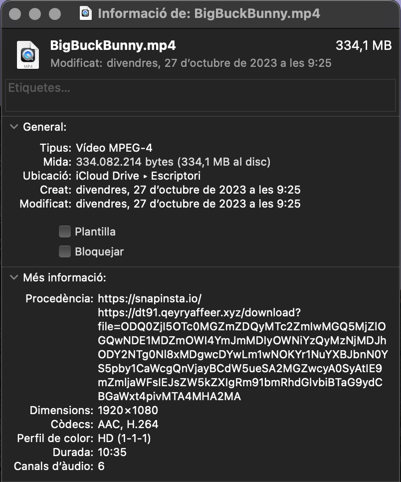
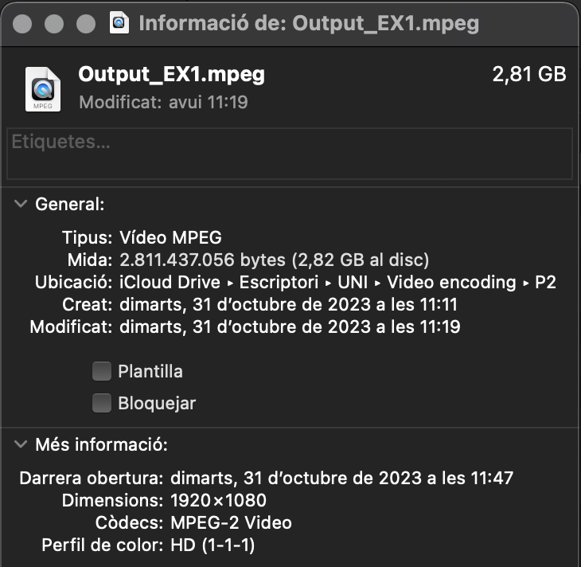
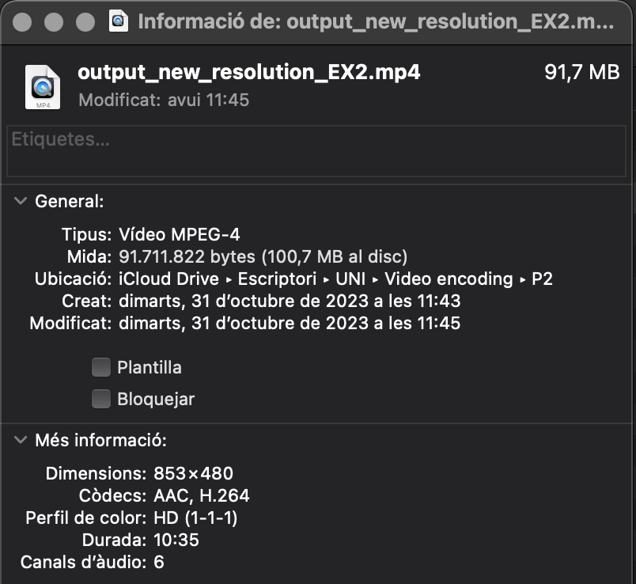
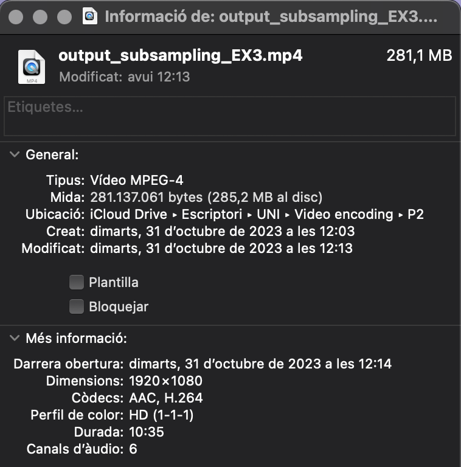

# PRÀCTICA 2: SCAV


## Descripció

Aquest repositori conté un script de Python amb els diferents exercicis de la segona pràctica. Els exercicis es descriuran a continuació, amb instruccions sobre com executar-los.

Primer de tot però, importem la funció "convert_to_bw_and_compress" de la pràctica anterior la qual utilitzarem en l'exercici 5:
```python
# Importem la funció per l'exercici 5
from rgb_yuv import convert_to_bw_and_compress
```
I definim el path del vídeo "Big Buck Bunny", amb el qual realitzarem tots els exercicis:
```python
#  Definim el path del video "Big Buck Bunny"
bunny = '/Users/perequilez/Desktop/BigBuckBunny.mp4'
```
Tenint en compte la seva informació original, la qual es veurà modificada com veurem, en els següents exercicis:



## Exercici 1 - Conversió de Vídeo a MP2

Aquest exercici demostra com convertir un fitxer de vídeo a un format MP2 utilitzant `ffmpeg`. La funció `convert_video_to_mpeg` realitza aquesta conversió, guardant el vídeo de sortida i la seva informació en un fitxer de text.

```python
def convert_video_to_mpeg(input_video, output_mp2_file, info_file='video_info.txt'):
    try:
        # Utilitzem 'ffmpeg' per convertir el vídeo d'entrada a un fitxer de vídeo MP2
        conversion_command = f'ffmpeg -i "{input_video}" -c:v mpeg2video -q:v 2 -an "{output_mp2_file}"'
        # Executem la comanda 'ffmpeg' per realitzar la conversió
        subprocess.run(conversion_command, shell=True)

        # Utilitzem 'ffmpeg' per analitzar la informació del vídeo i guardar-la en un fitxer de text
        info_command = f'ffmpeg -i "{output_mp2_file}" 2> "{info_file}"'
        # Executem la comanda 'ffmpeg' per obtenir la informació del vídeo
        subprocess.run(info_command, shell=True)

        return True, f"Vídeo convertit a MP2, desat com a {output_mp2_file} i informació desada com a {info_file}"
    except subprocess.CalledProcessError as e:
        # Si hi ha un error en l'execució de les comandes 'ffmpeg', capturem l'excepció i la retornem
        return False, str(e)
```
#### Resultat exercici 1:
Podeu trobar el resultat de l'exercici en el mateix repositori P2/video_info.txt.

En el cas del vídeo haureu d'executar el codi per veure el resultat:



## Exercici 2 - Modificació de la Resolució del Vídeo

Aquest exercici implica la modificació de la resolució d'un vídeo utilitzant `ffmpeg`. La funció `modify_resolution` realitza aquesta operació i guarda el vídeo de sortida.
```python
def modify_resolution(input_video, output_video, width, height):
    try:
        # Utilitzem 'ffmpeg' per modificar la resolució del vídeo
        ffmpeg_command = f'ffmpeg -i {input_video} -vf "scale={width}:{height}" {output_video}'
        # Executem la comanda 'ffmpeg' per canviar la resolució del vídeo d'entrada i guardar-lo com a vídeo de sortida
        subprocess.run(ffmpeg_command, shell=True, check=True)

        return True, f"Resolució del vídeo modificada i desada com a {output_video}"
    except subprocess.CalledProcessError as e:
        # Si hi ha un error en l'execució de la comanda 'ffmpeg', capturem l'excepció i la retornem
        return False, str(e)
```
#### Resultat exercici 2:
En el cas del vídeo haureu d'executar el codi per veure el resultat:



## Exercici 3 - Canvi de Submostreig Cromàtic

Aquest exercici implica el canvi de submostreig cromàtic d'un vídeo utilitzant `ffmpeg`. La funció `change_chroma_subsampling` realitza aquesta operació i guarda el vídeo de sortida.

```python
def change_chroma_subsampling(input_video, output_video, subsampling):
    try:
        # Utilitzem 'ffmpeg' per canviar el submostreig de croma del vídeo d'entrada
        ffmpeg_command = f'ffmpeg -i {input_video} -vf "format={subsampling}" -c:a copy {output_video}'
        # Executem la comanda 'ffmpeg' per realitzar el canvi de submostreig de croma
        subprocess.run(ffmpeg_command, shell=True, check=True)

        return True, f"Submostreig de croma canviat i desat com a {output_video}"
    except subprocess.CalledProcessError as e:
        # Si hi ha un error en l'execució de la comanda 'ffmpeg', capturem l'excepció i la retornem
        return False, str(e)
```
#### Resultat exercici 3:
En el cas del vídeo haureu d'executar el codi per veure el resultat:



## Exercici 4 - Lectura de la Informació del Vídeo

Aquest exercici implica la lectura i impressió de la informació d'un vídeo en format `JSON` utilitzant `ffprobe`. La funció `read_video_info` realitza aquesta operació i mostra la informació per pantalla.

```python
def read_video_info(video_path):
    try:
        # Executem ffprobe per obtenir la informació del vídeo en format JSON
        info_command = f'ffprobe -v error -select_streams v:0 -show_entries stream=codec_type,width,height,r_frame_rate,duration,bit_rate -of json "{video_path}"'
        info_output = subprocess.check_output(info_command, shell=True).decode('utf-8')

        # Analitzem la sortida JSON
        video_info = json.loads(info_output)
        # Guardem les dades rellevants
        stream_info = video_info['streams'][0]

        # Imprimim les dades rellevants
        print("Exercici 4: Informació del vídeo:")
        print(f"Tipus de codec: {stream_info['codec_type']}")
        print(f"Resolució: {stream_info['width']}x{stream_info['height']}")
        print(f"Taxa de quadres: {stream_info['r_frame_rate']}")
        print(f"Durada: {stream_info['duration']} segons")
        print(f"Taxa de bits: {stream_info['bit_rate']} bps")
        return True, f"Dades obtingudes correctament"
    except subprocess.CalledProcessError as e:
        # Si hi ha un error en l'execució de la comanda 'ffmpeg', capturem l'excepció i la retornem
        return False, str(e)
```
#### Resultat exercici 4:
```python
Exercici 4: Informació del vídeo:
Tipus de codec: video
Resolució: 1920x1080
Taxa de quadres: 60/1
Durada: 634.566667 segons
Taxa de bits: 3813575 bps
```
## Exercici 5 - Extracció d'un frame aleatori i conversió a Blanc i Negre

En quest exercici extreiem un frame aleatori del vídeo d'entrada, el qual posteriorment es converteix a blanc i negre a través de la funció de la pràctica anterior `convert_to_bw_and_compress`, la qual hem importat al principi de la pràctica. La funció `extract_random_frame_and_convert_to_bw` realitza aquesta operació i guarda la imatge/frame de sortida.


```python
def extract_random_frame_and_convert_to_bw(video_path, output_image_path, quality=2):
    try:
        # Obtenim la durada del vídeo
        info_command = f'ffprobe -v error -show_entries format=duration -of default=noprint_wrappers=1:nokey=1 "{video_path}"'
        duration = float(subprocess.check_output(info_command, shell=True))

        # Escollim un instant aleatori dins de la durada del vídeo
        random_time = random.uniform(0, duration)

        # Extraiem el frame aleatori i el desem com a imatge
        extract_command = f'ffmpeg -ss {random_time} -i "{video_path}" -vframes 1 "{"random_frame.jpeg"}"'
        subprocess.run(extract_command, shell=True)

        # Apliquem la funció convert_to_bw_and_compress al frame random i el guardem
        convert_to_bw_and_compress("random_frame.jpeg", output_image_path, quality)
        return True, f"Conversió a bw del frame aleatori feta i desat com a {output_image_path}"
    except subprocess.CalledProcessError as e:
        # Si hi ha un error en l'execució de la comanda 'ffmpeg', capturem l'excepció i la retornem
        return False, str(e)
```
#### Resultat exercici 5:
Un exemple de resultat sería:


## Com executar l'script

Per a executar l'script i provar els diversos exercicis, utilitzem la funció `main()`, a través de la terminal i especificant el número d'exercici com a argument. Podem veure els exercicis definits a la funció principal, `main()`:

```python
def main():
    # Creem un analitzador d'arguments de línia de comandes
    parser = argparse.ArgumentParser(description='Executa un exercici específic')  # Creem un objecte d'analitzador d'arguments amb una descripció
    parser.add_argument('exercici', type=int, help='Número de l\'exercici (1-4)')  # Afegim un argument que espera un número d'exercici
    args = parser.parse_args()  # Analitzem els arguments de la línia de comandes

    # Cridem als exercicis basats en l'argument 'exercici'
    if args.exercici == 1:  # Si l'argument 'exercici' és igual a 1
        success, message = convert_video_to_mpeg(bunny, 'Output_EX1.mpeg', "video_info.txt")  # Executem la funció 'convert_video_to_mpeg' amb els arguments especificats
        print("EXERCICI 1:", message)
    elif args.exercici == 2:  # Si l'argument 'exercici' és igual a 2
        success, message = modify_resolution(bunny, "output_new_resolution_EX2.mp4", 640, 480)  # Executem la funció 'modify_resolution' amb els arguments especificats
        print("EXERCICI 2:", message)  # Mostrem un missatge amb el resultat de l'exercici 2
    elif args.exercici == 3:  # Si l'argument 'exercici' és igual a 3
        success, message = change_chroma_subsampling(bunny, "output_subsampling_EX3.mp4", "yuv420p")  # Executem la funció 'change_chroma_subsampling' amb els arguments especificats
        print("EXERCICI 3:", message)  # Mostrem un missatge amb el resultat de l'exercici 3
    elif args.exercici == 4:  # Si l'argument 'exercici' és igual a 4
        success, message = read_video_info(bunny)  # Executem la funció 'read_video_info' amb l'arxiu de vídeo especificat
        print("EXERCICI 4:", message)
    elif args.exercici == 5:  # Si l'argument 'exercici' és igual a 5
        success, message =extract_random_frame_and_convert_to_bw(bunny, 'random_frame_bw.jpeg', quality=2)  # Executem la funció 'extract_random_frame_and_convert_to_bw' amb els arguments especificats
        print("EXERCICI 5:", message)
    else:  # Si l'argument 'exercici' no coincideix amb cap dels valors anteriors
        print("Número d'exercici no vàlid. Si us plau, introduïu un número d'exercici entre 1 i 4.")  # Mostrem un missatge d'error


if __name__ == "__main__":
    main()
```

Per tal d'executar un exercici:
Exemple: `python3 python_video.py 1`
Això executarà l'exercici 1 amb els valors indicats en el `main()` i proporcionarà els resultats. 

Canviant el número "1" de la comanda podràs executar els diferents exercicis, introduïnt un número de (1-5).


