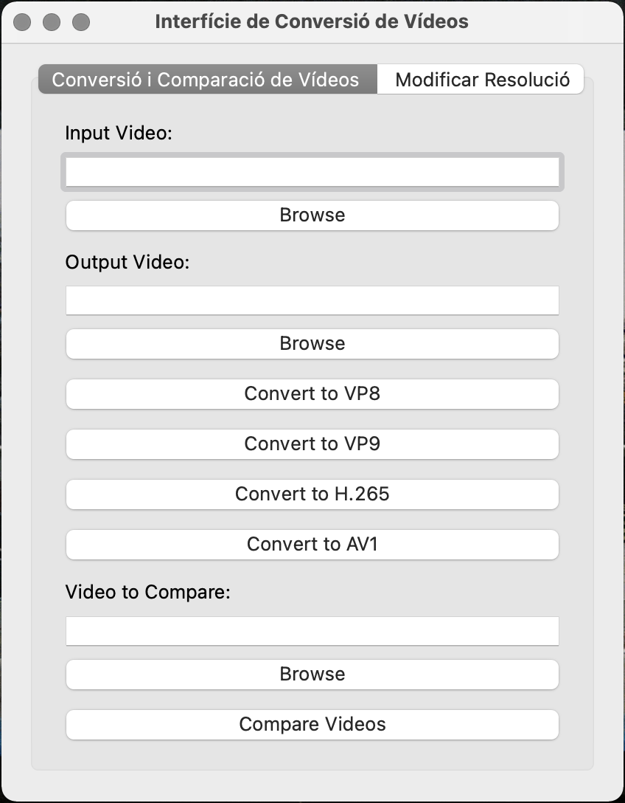
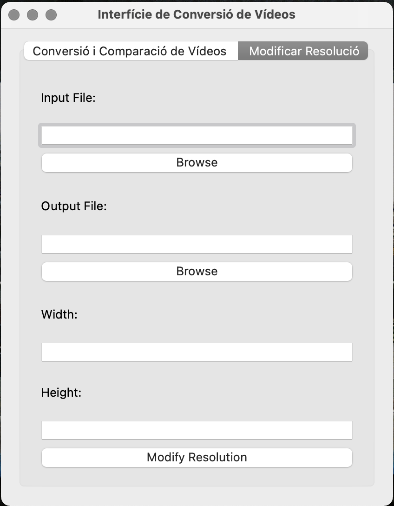
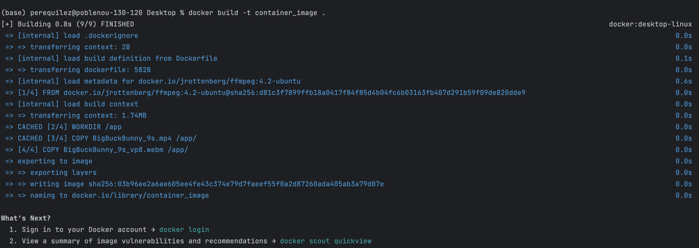
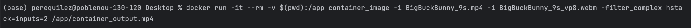

# PRÀCTICA 4: SCAV

## Descripció

Aquest repositori conté un script de Python amb els diferents exercicis de la quarta pràctica. Els exercicis es descriuran a continuació, amb instruccions sobre com executar-los.

Primer de tot però, importem la funció " export_video_comparison" del fitxer .py auxilar per a realitzar l'exercici 2:

```python
# Importem la funció export_video_comparison del fitxer EX_2.py
from EX_2 import export_video_comparison
```
També definim el path del vídeo "Big Buck Bunny 9s", amb el qual realitzarem els exercicis:
```python
#  Definim el path del video "Big Buck Bunny de 9s"
bunny_9s = '/Users/perequilez/Desktop/BigBuckBunny_9s.mp4'
```

## Exercici 1 - Modificar Resolució i Convertir a VP8, VP9, H.265, AV1

Aquest exercici permet modificar la resolució d'un vídeo i convertir-lo als formats VP8, VP9, H.265 i AV1. Les funcions es troben dins la classe VideoConverter.

Abans de començar doncs, creem una classe "VideoConverter" en la qual hi implementarem les diferents funcions de l'exercici 1:
```python
class VideoConverter:
          .
          .
          .
```
Un cop creada la classe ja hi podem implementar les diferents funcions de l'exercici 1:
```python
# EXERCICI 1
class VideoConverter:
    @staticmethod
    def modify_resolution(input_video, output_video, width, height):
        try:
            # Utilitzem 'ffmpeg' per modificar la resolució del vídeo
            ffmpeg_command = (f'ffmpeg -i {input_video} -vf "scale={width}:{height}" {output_video}_{width}x{height}_.mp4')
            # Executem la comanda 'ffmpeg' per canviar la resolució del vídeo d'entrada i guardar-lo com a vídeo de sortida
            subprocess.run(ffmpeg_command, shell=True, check=True)

            return True, f"Hem modificat la resolució del vídeo i l'hem guardat com a {output_video}"
        except subprocess.CalledProcessError as e:
            # Si hi ha un error en l'execució de la comanda 'ffmpeg', capturem l'excepció i la retornem
            return False, str(e)

    @staticmethod
    def convert_to_vp8(input_file, output_file):
        try:
            # Utilitzem 'ffmpeg' per convertir el vídeo a VP8
            command = f"ffmpeg -i {input_file} -c:v libvpx -b:v 1M -c:a libvorbis {output_file}_vp8.webm"
            subprocess.call(command, shell=True)
        except Exception as e:
            # Capturem qualsevol excepció que pugui produir-se durant la conversió a VP8
            print(f"Error durant la conversió a VP8: {e}")

    @staticmethod
    def convert_to_vp9(input_file, output_file):
        try:
            # Utilitzem 'ffmpeg' per convertir el vídeo a VP9
            command = f"ffmpeg -i {input_file} -c:v libvpx-vp9 -b:v 1M -c:a libvorbis {output_file}_vp9.webm"
            subprocess.call(command, shell=True)
        except Exception as e:
            # Capturem qualsevol excepció que pugui produir-se durant la conversió a VP9
            print(f"Error durant la conversió a VP9: {e}")

    @staticmethod
    def convert_to_h265(input_file, output_file):
        try:
            # Utilitzem 'ffmpeg' per convertir el vídeo a H.265
            command = f"ffmpeg -i {input_file} -c:a copy -c:v libx265 {output_file}_h265.mp4"
            subprocess.call(command, shell=True)
        except Exception as e:
            # Capturem qualsevol excepció que pugui produir-se durant la conversió a H.265
            print(f"Error durant la conversió a H.265: {e}")

    @staticmethod
    def convert_to_av1(input_file, output_file):
        try:
            # Utilitzem 'ffmpeg' per convertir el vídeo a AV1
            command = f"ffmpeg -i {input_file} -c:v libaom-av1 -crf 30 {output_file}_av1.mkv"
            subprocess.call(command, shell=True)
        except Exception as e:
            # Capturem qualsevol excepció que pugui produir-se durant la conversió a AV1
            print(f"Error durant la conversió a AV1: {e}")

```
#### Resultats exercici 1:
Podeu trobar els resultats de l'exercici en el mateix repositori P4/:
- output_video_EX1_360x240_.mp4
- output_video_EX1_av1.mkv
- output_video_EX1_h265.mp4
- output_video_EX1_vp8.webm
- output_video_EX1_vp9.webm

## Exercici 2: Comparar Vídeos

Aquest exercici permet comparar dos vídeos i crear un nou vídeo ambdós un al costat de l'altre. L'exercici està implementat en el fitxer "EX_2.py".

```python
# EXERCICI 2

def modify_resolution(input_video, output_video, width, height):
    try:
        # Utilitzem 'ffmpeg' per modificar la resolució del vídeo
        ffmpeg_command = (f'ffmpeg -i {input_video} -vf "scale={width}:{height}" {output_video}_{width}x{height}_.mp4')
        # Executem la comanda 'ffmpeg' per canviar la resolució del vídeo d'entrada i guardar-lo com a vídeo de sortida
        subprocess.run(ffmpeg_command, shell=True, check=True)
        return True, f"Hem modificat la resolució del vídeo i l'hem guardat com a {output_video}"
    except subprocess.CalledProcessError as e:
        # Si hi ha un error en l'execució de la comanda 'ffmpeg', capturem l'excepció i la retornem
        return False, str(e)
```
#### Resultat exercici 2:
Podeu trobar els resultats de l'exercici en el mateix repositori P4/output_EX2_compared.mp4.


El vídeo de sortida està comparant el mateix vídeo en formats diferents, vp8 (esquerre) i vp9 (dreta).
La comparativa entre VP8 i VP9 en termes de compressió de vídeo revela diferències notables. Mentre que VP9 ofereix una qualitat superior i una millor compressió, VP8 és més lleuger. VP9, amb la seva millor eficiència de compressió, ofereix imatges més nítides i detallades, especialment a baixos bitrates. Això es tradueix en una millor qualitat d'imatge amb arxius més petits. En canvi, utilitzar VP8 pot mostrar algunes limitacions, sobretot en baixes velocitats de bits. 


## Exercici 3: Interfície Gràfica d'Usuari (GUI)

Aquest exercici implementa una interfície gràfica d'usuari (GUI) a través de la llibreria PyQt5. L'aplicació permet modificar el format d'un vídeo i convertir-lo als formats VP8, VP9, H.265 i AV1. També permet comparar el vídeo d'entrada amb un altre i a part, en una altre pestanya, també es pot modificar la resolució d'un vídeo d'entrada. Les funcions utilitzades són les implementades anteriorment i per tant, s'hereten en aquest scrip per utilitzar-les.

```python
import sys
import subprocess
from PyQt5.QtWidgets import QApplication, QWidget, QLabel, QLineEdit, QPushButton, QVBoxLayout, QFileDialog, QTabWidget, \
    QMessageBox

# Importem la funció export_video_comparison del script EX_2
from EX_2 import export_video_comparison

# Importem la classe VideoConverter del script final_exercices
from final_exercices import VideoConverter

# Creem una instància de VideoConverter
Vid_Conv = VideoConverter()

# Definim la classe VideoConverterGUI que hereta de QWidget
class VideoConverterGUI(QWidget):
    def __init__(self):
        super().__init__()

        # Inicialitzem la interfície d'usuari
        self.init_ui()

    def init_ui(self):
        # Creem un objecte QTabWidget
        self.tabs = QTabWidget()

        # Creem una pestanya per a la conversió i comparació de vídeos
        self.tab1 = QWidget()
        self.init_tab1()
        self.tabs.addTab(self.tab1, 'Conversió i Comparació de Vídeos')

        # Creem una pestanya per a modificar la resolució
        self.tab2 = QWidget()
        self.init_tab2()
        self.tabs.addTab(self.tab2, 'Modificar Resolució')

        # Creem un disseny vertical i afegim les pestanyes
        vbox = QVBoxLayout()
        vbox.addWidget(self.tabs)

        # Establim el disseny pel widget principal
        self.setLayout(vbox)

    def init_tab1(self):
        # Creem etiquetes i elements d'entrada per a la pestanya 1
        self.input_label_tab1 = QLabel('Input Video:')
        self.input_entry_tab1 = QLineEdit()
        self.input_button_tab1 = QPushButton('Browse')
        self.input_button_tab1.clicked.connect(self.browse_input_tab1)

        self.output_label_tab1 = QLabel('Output Video:')
        self.output_entry_tab1 = QLineEdit()
        self.output_button_tab1 = QPushButton('Browse')
        self.output_button_tab1.clicked.connect(self.browse_output_tab1)

        self.vp8_button_tab1 = QPushButton('Convert to VP8')
        self.vp8_button_tab1.clicked.connect(self.convert_to_vp8_tab1)

        self.vp9_button_tab1 = QPushButton('Convert to VP9')
        self.vp9_button_tab1.clicked.connect(self.convert_to_vp9_tab1)

        self.h265_button_tab1 = QPushButton('Convert to H.265')
        self.h265_button_tab1.clicked.connect(self.convert_to_h265_tab1)

        self.av1_button_tab1 = QPushButton('Convert to AV1')
        self.av1_button_tab1.clicked.connect(self.convert_to_av1_tab1)

        self.compare_label_tab1 = QLabel('Video to Compare:')
        self.compare_entry_tab1 = QLineEdit()
        self.compare_button_tab1 = QPushButton('Browse')
        self.compare_button_tab1.clicked.connect(self.browse_compare_tab1)

        self.compare_videos_button_tab1 = QPushButton('Compare Videos')
        self.compare_videos_button_tab1.clicked.connect(self.compare_videos_tab1)

        # Creem un disseny vertical i afegim els elements
        vbox = QVBoxLayout()
        vbox.addWidget(self.input_label_tab1)
        vbox.addWidget(self.input_entry_tab1)
        vbox.addWidget(self.input_button_tab1)
        vbox.addWidget(self.output_label_tab1)
        vbox.addWidget(self.output_entry_tab1)
        vbox.addWidget(self.output_button_tab1)
        vbox.addWidget(self.vp8_button_tab1)
        vbox.addWidget(self.vp9_button_tab1)
        vbox.addWidget(self.h265_button_tab1)
        vbox.addWidget(self.av1_button_tab1)
        vbox.addWidget(self.compare_label_tab1)
        vbox.addWidget(self.compare_entry_tab1)
        vbox.addWidget(self.compare_button_tab1)
        vbox.addWidget(self.compare_videos_button_tab1)

        # Establim el disseny a la pestanya 1
        self.tab1.setLayout(vbox)

    def init_tab2(self):
        # Creem etiquetes i elements d'entrada per a la pestanya 2
        self.input_label_tab2 = QLabel('Input File:')
        self.input_entry_tab2 = QLineEdit()
        self.input_button_tab2 = QPushButton('Browse')
        self.input_button_tab2.clicked.connect(self.browse_input_tab2)

        self.output_label_tab2 = QLabel('Output File:')
        self.output_entry_tab2 = QLineEdit()
        self.output_button_tab2 = QPushButton('Browse')
        self.output_button_tab2.clicked.connect(self.browse_output_tab2)

        self.width_label_tab2 = QLabel('Width:')
        self.width_entry_tab2 = QLineEdit()

        self.height_label_tab2 = QLabel('Height:')
        self.height_entry_tab2 = QLineEdit()

        # Corregim el nom de l'atribut aquí
        self.modify_resolution_button_tab2 = QPushButton('Modify Resolution')
        self.modify_resolution_button_tab2.clicked.connect(self.modify_resolution_tab2)

        # Creem un disseny vertical i afegim els elements
        vbox = QVBoxLayout()
        vbox.addWidget(self.input_label_tab2)
        vbox.addWidget(self.input_entry_tab2)
        vbox.addWidget(self.input_button_tab2)
        vbox.addWidget(self.output_label_tab2)
        vbox.addWidget(self.output_entry_tab2)
        vbox.addWidget(self.output_button_tab2)
        vbox.addWidget(self.width_label_tab2)
        vbox.addWidget(self.width_entry_tab2)
        vbox.addWidget(self.height_label_tab2)
        vbox.addWidget(self.height_entry_tab2)

        # Corregim el nom de l'atribut aquí
        vbox.addWidget(self.modify_resolution_button_tab2)

        # Establim el disseny a la pestanya 2
        self.tab2.setLayout(vbox)

    def browse_input_tab1(self):
        # Naveguem pel sistema de fitxers per seleccionar el vídeo d'entrada a la pestanya 1
        file_path, _ = QFileDialog.getOpenFileName(self, 'Open Input Video', '', 'All files (*.*);;Video files')
        self.input_entry_tab1.setText(file_path)

    def browse_output_tab1(self):
        # Naveguem pel sistema de fitxers per seleccionar la ubicació de sortida del vídeo a la pestanya 1
        file_path, _ = QFileDialog.getSaveFileName(self, 'Save Output Video', '', 'Video files')
        self.output_entry_tab1.setText(file_path)

    def browse_input_tab2(self):
        # Naveguem pel sistema de fitxers per seleccionar el fitxer d'entrada a la pestanya 2
        file_path, _ = QFileDialog.getOpenFileName(self, 'Open Input Video', '', 'All files (*.*);;Video files')
        self.input_entry_tab2.setText(file_path)

    def browse_output_tab2(self):
        # Naveguem pel sistema de fitxers per seleccionar la ubicació de sortida del fitxer a la pestanya 2
        file_path, _ = QFileDialog.getSaveFileName(self, 'Save Output Video', '', 'Video files')
        self.output_entry_tab2.setText(file_path)

    def modify_resolution_tab2(self):
        # Modifiquem la resolució del vídeo a la pestanya 2
        input_video = self.input_entry_tab2.text()
        output_video = self.output_entry_tab2.text()
        width = self.width_entry_tab2.text()
        height = self.height_entry_tab2.text()

        if input_video and output_video and width and height:
            success, message = Vid_Conv.modify_resolution(input_video, output_video, width, height)
            if success:
                QMessageBox.information(self, 'Success', message)
            else:
                QMessageBox.critical(self, 'Error', message)
        else:
            QMessageBox.critical(self, 'Error', 'Please provide input, output, width, and height.')

    def browse_compare_tab1(self):
        # Naveguem pel sistema de fitxers per seleccionar el vídeo de comparació a la pestanya 1
        file_path, _ = QFileDialog.getOpenFileName(self, 'Open Video to Compare', '', 'All files (*.*);;Video files')
        self.compare_entry_tab1.setText(file_path)

    def compare_videos_tab1(self):
        # Comparem dos vídeos a la pestanya 1
        input_video = self.input_entry_tab1.text()
        compare_video = self.compare_entry_tab1.text()
        output_file = self.output_entry_tab1.text()

        if input_video and compare_video and output_file:
            export_video_comparison(input_video, compare_video, output_file)
            QMessageBox.information(self, 'Success', 'Video comparison completed successfully.')
        else:
            QMessageBox.critical(self, 'Error', 'Please provide input, video to compare, and output video files.')

    def convert_to_vp8_tab1(self):
        # Convertim el vídeo a VP8 a la pestanya 1
        input_file = self.input_entry_tab1.text()
        output_file = self.output_entry_tab1.text() + "_vp8.webm"

        try:
            command = f"ffmpeg -i {input_file} -c:v libvpx -b:v 1M -c:a libvorbis {output_file}"
            subprocess.call(command, shell=True)
            print(f"Conversion to VP8 successful: {input_file} -> {output_file}")
        except Exception as e:
            print(f"Error during VP8 conversion: {e}")

    def convert_to_vp9_tab1(self):
        # Convertim el vídeo a VP9 a la pestanya 1
        input_file = self.input_entry_tab1.text()
        output_file = self.output_entry_tab1.text() + "_vp9.webm"

        try:
            command = f"ffmpeg -i {input_file} -c:v libvpx-vp9 -b:v 1M -c:a libvorbis {output_file}"
            subprocess.call(command, shell=True)
            print(f"Conversion to VP9 successful: {input_file} -> {output_file}")
        except Exception as e:
            print(f"Error during VP9 conversion: {e}")

    def convert_to_h265_tab1(self):
        # Convertim el vídeo a H.265 a la pestanya 1
        input_file = self.input_entry_tab1.text()
        output_file = self.output_entry_tab1.text() + ".mp4"

        try:
            command = f"ffmpeg -i {input_file} -c:a copy -c:v libx265 {output_file}"
            subprocess.call(command, shell=True)
            print(f"Conversion to H.265 successful: {input_file} -> {output_file}")
        except Exception as e:
            print(f"Error during H.265 conversion: {e}")

    def convert_to_av1_tab1(self):
        # Convertim el vídeo a AV1 a la pestanya 1
        input_file = self.input_entry_tab1.text()
        output_file = self.output_entry_tab1.text() + ".mkv"

        try:
            command = f"ffmpeg -i {input_file} -c:v libaom-av1 -crf 30 {output_file}"
            subprocess.call(command, shell=True)
            print(f"Conversion to AV1 successful: {input_file} -> {output_file}")
        except Exception as e:
            print(f"Error during AV1 conversion: {e}")

    def convert_video_tab1(self, conversion_function):
        # Convertim vídeos a la pestanya 1 amb la funció de conversió proporcionada
        input_file = self.input_entry_tab1.text()
        output_file = self.output_entry_tab1.text()

        if input_file and output_file:
            conversion_function(input_file, output_file)
            QMessageBox.information(self, 'Success', 'Video conversion completed successfully.')
        else:
            QMessageBox.critical(self, 'Error', 'Please provide input and output video files.')

# Punt d'entrada del programa
if __name__ == '__main__':
    # Creem una aplicació PyQt
    app = QApplication(sys.argv)

    # Creem una instància de la classe VideoConverterGUI
    window = VideoConverterGUI()

    # Configurem el títol de la finestra
    window.setWindowTitle('Interfície de Conversió de Vídeos')

    # Mostrem la finestra
    window.show()

    # Executem l'aplicació
    sys.exit(app.exec_())
```

#### Resultat exercici 3:

En aquest cas, quan executem l'ecercici s'ens obra una pestanya la qual ens permet realitzar totes les conversions vistes en l'exercici anterior però a través d'una interfície gràfica. Els resultats que es poden obtenir són els mateixos que en l'exercici anterior. Si executem l'exercici s'ens obra una interficie amb dues pestanyes:

 

Interectuant amb l'interficie i indicant els fitxers i paths amb els que volem treballar, podrem relaitzar les conversions i comparacions entre aqesuts, obtenint els resultast desitjats i guardant-los al path indicat.

## Exercici 4: Docker

## Descripció

Docker és una plataforma que facilita el desenvolupament, distribució i l'execució d'aplicacions mitjançant contenidors. Aquests contenidors són unitats lleugeres i portàtils que encapsulen software i les seves dependencies. En aquest exercici, l'objectiu és construir un contenidor Docker que contingui FFMPEG, una eina de processament de vídeo, oferint una manera creativa d'utilitzar aquest contenidor per processar alguna cosa. Amb Docker, es pot assegurar la consistència de l'aplicació en diversos entorns, millorar la portabilitat i simplificar la gestió del desplegament de software.

En aquest cas, utilitzarem el Docker per a realitzar la comparació entre dos vídeos. Per a fer-ho hem de seguir diferents passos:

### 4.1. Creació del fitxer Dockerfile:

```python
# Utilitzem una imatge base amb FFMPEG
FROM jrottenberg/ffmpeg:4.2-ubuntu

# Establim el directori de treball
WORKDIR /app

# Copiem  arxius de vídeo que volem comparar dins el contenidor
COPY BigBuckBunny_9s.mp4 /app/
COPY BigBuckBunny_9s_vp8.webm /app/

# Comanda per defecte que s'executarà quan el contenidor comenci
CMD ["ffmpeg"]
```

### 4.2. Construcció de la Imatge Docker:
Per tal de construïr la imatge executem la següent comanda:

```python
# Construïm una imatge de contenidor amb l'etiqueta "container_image" a partir del context actual (".")
docker build -t container_image .
```



### 4.3. Execució del Contenidor:
Per tal d'executar el contenidor i que es realitzi la comparació dels videos utilitzem la següent comanda:

```python
# Executem un contenidor amb les següents opcions:
#   -it: Connecta el terminal interactiu del contenidor a l'entrada estàndard
#   --rm: Elimina el contenidor després de la seva execució
#   -v $(pwd):/app: Monta el directori actual a /app dins del contenidor
# container_image: Utilitza l'imatge de contenidor amb l'etiqueta "container_image"
# -i BigBuckBunny_9s.mp4 -i BigBuckBunny_9s_vp8.webm: Especifica els fitxers d'entrada dins del contenidor
# -filter_complex hstack=inputs=2: Aplica el filtre complex per a apilar els dos vídeos horitzontalment
# /app/container_output.mp4: Especifica el fitxer de sortida dins del contenidor

docker run -it --rm -v $(pwd):/app container_image -i BigBuckBunny_9s.mp4 -i BigBuckBunny_9s_vp8.webm -filter_complex hstack=inputs=2 /app/container_output.mp4
```


### 4.4. Sortida:
Podeu trobar el vídeo de sortida en el mateix repositori P4/output_EX2_compared.mp4.


## Com executar l'script

Per a executar l'script i provar els diversos exercicis, utilitzem la funció `main()`, a través de la terminal i especificant el número d'exercici com a argument. Podem veure els exercicis definits a la funció principal, `main()`:

```python
def main():
    # Creem un analitzador d'arguments de línia de comandes
    parser = argparse.ArgumentParser(description='Executa un exercici específic')  # Creem un objecte d'analitzador d'arguments amb una descripció
    parser.add_argument('exercici', type=int, help='Número de l\'exercici (1-8)')  # Afegim un argument que espera un número d'exercici
    args = parser.parse_args()  # Analitzem els arguments de la línia de comandes

    # Cridem als exercicis basats en l'argument 'exercici'
    if args.exercici == 1:  # Si l'argument 'exercici' és igual a 1
        # Executem la funció de modificar resolució
        VideoConverter.modify_resolution(input_video, f"output_video_EX1", 360, 240)
    elif args.exercici == 2:  # Si l'argument 'exercici' és igual a 2
        # Executem la funció de convertir a VP8
        VideoConverter.convert_to_vp8(input_video, f"output_video_EX1")
    elif args.exercici == 3:  # Si l'argument 'exercici' és igual a 3
        # Executem la funció de convertir a VP9
        VideoConverter.convert_to_vp9(input_video, f"output_video_EX1")
    elif args.exercici == 4:  # Si l'argument 'exercici' és igual a 4
        # Executem la funció de convertir a H.265
        VideoConverter.convert_to_h265(input_video, f"output_video_EX1")
    elif args.exercici == 5:  # Si l'argument 'exercici' és igual a 5
        # Executem la funció de convertir a AV1
        VideoConverter.convert_to_av1(input_video, f"output_video_EX1")
    elif args.exercici == 6:  # Si l'argument 'exercici' és igual a 6
        # Executem la funció de comparar vídeos
        export_video_comparison("output_video_EX1_vp8.webm", "output_video_EX1_vp9.webm", "output_EX2")
    elif args.exercici == 7:  # Si l'argument 'exercici' és igual a 7
        # Ruta al script que desitgem executar
        script_EX_3_path = 'EX_3_GUI.py'
        # Executem el script
        subprocess.run(['python', script_EX_3_path])
    elif args.exercici == 8:  # Si l'argument 'exercici' és igual a 8
        pass
    else:  # Si l'argument 'exercici' no coincideix amb cap dels valors anteriors
        print("Número d'exercici no vàlid. Si us plau, trieu un exercici entre 1 i 8")  # Mostrem un missatge d'error


if __name__ == "__main__":
    main()

```

Per tal d'executar un exercici:
Exemple: python3 VideoConverter.py 1
Això executarà l'exercici 1 amb els valors indicats en el main() i proporcionarà els resultats.

Canviant el número "1" de la comanda podràs executar els diferents exercicis, introduïnt un número (1-8). Cal tenir en compte que en aquesta pràctica el número de la comanda no coincideix amb l'exercici que s'executrà ja que hi ha un número per executar cada funció de l'exercici 1 (1-5), per l'exercici 2 (6) i per lexercici 3 (7).
